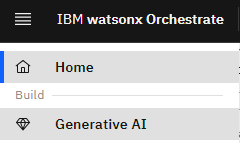
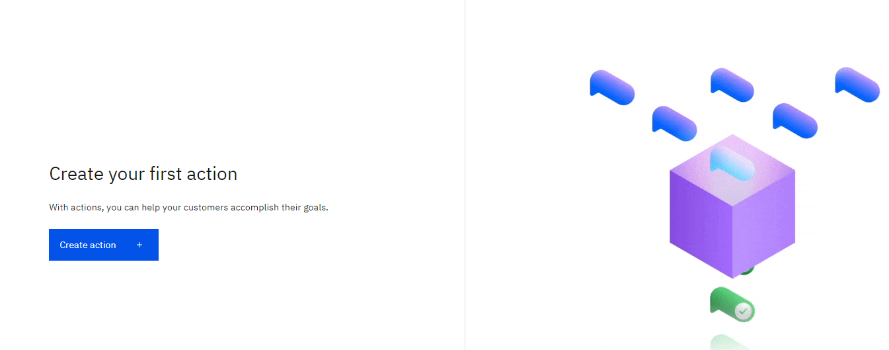
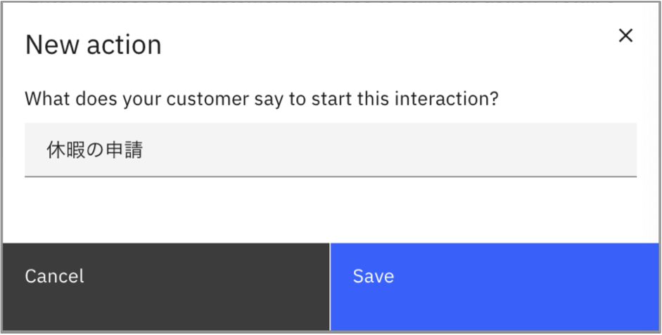
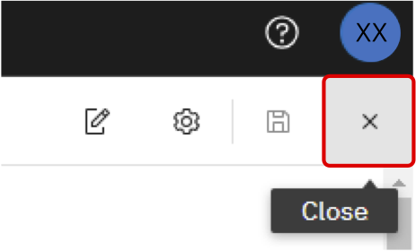

# Lab5 AIアシスタント・ビルダーr

このLabでは、AIアシスタント・ビルダーを用いて、AI アシスタントを構築します。生成AIを用いて回答するアクションや、これまでのハンズオンで作成したスキルを呼び出すアクションを定義し、動作を確認します。

## AIアシスタントの作成

 1. watsonx Orchestrateにログインし、**AIアシスタント・ビルダー**をクリックします。もしくは、左上のメニューから**AIアシスタント・ビルダー**を選択してください。  

 
 2. 画面上部にAssistantのリストがあります。そこを展開し、**Create New ＋**をクリックします。  

 
 6. Assistantの作成ダイアログが表示されるので、***YourInitials*-Assistant**という名前を入力し、**Create assistant**をクリックしてください。Assistant Languageとして日本語を選択することも可能ですが、現時点で一部の機能が使用できないため今回は**English**のままハンズオンを行います。
 

 7. Assistantが作成されます。画面下部に全体のアーキテクチャが表示されています。このハンズオンでは、**General purpose**、**AI-guided**、**Skill-based**の3つの動作を確認します。      
 

## LLMによる基本動作の確認
AI AssistantではLLMを用いて回答を生成することが可能です。また、LLMによる回答を望まない場合には、LLMによる一般的な回答を行わないように設定することが可能です。Elastic Searchとの統合を構成することで、検索結果をもとに生成AIで回答を生成するいわゆるRAG(Retrieval Augumented Generation)のパターンを構成することも可能ですが、今回のハンズオンでは行いません。

 1. 左側のリストより、**Generative AI** を選択してください。   
 
 
 2. 以下のような画面が表示されます。この画面からは生成AIに関する設定を行うことが可能です。上部選択リストを展開し、利用可能なLLMを確認してください。今回はデフォルトで設定されている、graniteをそのまま使用します。  
 　
 
 3. 右下に表示されているプレビューの入力欄に**IBMについて教えて**と入力して送信してください。LLMによって一般的な質問に対しての回答が生成されます。場合によっては英語で返答
 されてしまうこともあります。その場合には、次の手順で指示を与えます。  
 

 4. Add instructionsボタンをクリックし、追加の支持を与えます。入力欄が表示されるので**日本語で回答してください**と入力します。  
 

 5. チャットのプレビューの右上にあるRestart Conversationアイコンをクリックし、再びチャット欄から**IBMについて教えて**と入力し、日本語で回答があることを確認します。  
 

 4. LLMが一般的な質問に対して回答を行うかどうかは、**Answer behavior** の **General-purpose answering** で設定することが可能です。右側にあるトグルスイッチをクリックし、OFFにしてください。  
 
 
 5. 再びプレビューをリスタートし、入力欄に**IBMについて教えて**と入力してください。先ほどとは回答が異なることを確認します。  
 
 
 6. **General-purpose answering** をONに戻し、いくつかのLLMを切り替えたり、指示を変更したりして、様々な質問に対する回答を確認してみてください。  


## AI-Guided Actionの作成
AI-Guilded Actionは、ユーザーの入力が特定のインテント(意図)にマッチした場合に、LLMによって回答を生成する機能です。インテントごとに細かく生成AIの振る舞いや前提知識を指定することで、RAGと同様に根拠のある回答を行うことが可能です。

 1. 左側のメニューより、**Actions**を選択してください。    
 
 
 2. **Create action +**をクリックしてください。    
 
 
 3. 作成可能な3つのactionが表示されます。**AI-Guilded action**を選択してください。  
 
 
 4. 今回は日本語で動作するアクションを作成してみます。ダイアログが表示されるので、**休暇の申請**と入力し、**Save**をクリックしてください。   
 
 
 5. 左側の **Configuration** をクリックすると設定画面が表示されます。Select modelから使用するLLMを選択することが可能です。今回は**llama3-1-8b-instruct**を選択してください。  
 
 
 6. **Add knowledge** の欄に以下のテキストをコピー＆ペーストしてください。ここにLLMが動作する際に使用する知識を記入することで、知識に基づいた回答を生成することが可能です。  
 ```
 年次有給休暇の申請方法
 
 年次有給休暇の申請は、原則としてWorkdayで事前に行ってください。
 所属長は、Workdayにて申請された内容を確認し、速やかに承認処理を行ってください。Workdayの操作方法についてはこちらをご参照ください。
 （注）やむを得ない事情により申請が事後となった場合は、欠勤後の出社第1日目の終業時刻または当該欠勤日から1カ月後のうち、いずれか早い到来日までに所属長に申し出ることで、欠勤第1日から年休に振り替えることができます。ただし、無断欠勤の場合は、振り替えることができません。
 ```
 
 
 7. **Add prompt instructions** の欄により詳細な指示を指定することが可能です。今回は日本語で回答することを明示的に指定するため、**日本語で簡潔に回答してください。**と記入してください。  
 
 
 8. 右上のアイコンより変更を保存してください。  
 
 
 8. 右下のチャットのプレビューに **休暇の申請はどこから行いますか？** と記入して送信してください。Add knowledgeに記入した知識を元に回答が適切に生成されることを確認してください。  
 
 
 9. 休暇に関する質問をいくつかして、動作を確認してください。
 
 10. 右上の **x** をクリックして、設定画面を閉じてください。  
 


## Skill based Actionの作成
Skill based actionを用いることで、AI-Assistantからスキルを呼び出すことが可能です。今回はハンズオンで作成した生成AIのスキルを呼び出すアクションを定義してみましょう。なお、アプリケーションの接続(認証)が必要なスキルは管理者による登録作業が必要ですが、生成AIスキルは認証無しに呼び出すことが可能なため、この作業は必要ありません。

 1. **New action** をクリックしてください。  
 
 
 2. Skill-based actionをクリックしてください。  
 
 
 3. スキルの選択画面が表示されるので、ハンズオンで作成した ***YourInitials*generateRecommendationMail** を選択し、右上の **Next** をクリックしてください。 （生成AIのハンズオンを実施していない場合は任意のスキルを選択してください） 
 
 
 4. **New action** でスキルを呼び出すためのフレーズとなる **メールの生成** と入力して **Save** をクリックします。

 
 5. さきほど入力した **メールの生成** がフレーズとして登録されていることが確認できます。なお、ここでスキルを呼び出すためのフレーズは追加することができます。複数のフレーズを指定することで認識の精度が高まります。

 
 6. 右上のアイコンより変更を保存してください。  
 
 
 7. 右下のチャット・プレビューに **メールの生成** と記入し、送信してください。スキルが呼び出され、呼び出しに必要な項目が聞かれます。（今回は生成AI作成時に項目名をカスタマイズしており、それがそのまま表示されていますがカスタマイズ可能です。また、設定を切り替えることで、フォーム入力にするか、チャットで1つづつ入力パラメータを確認するかの変更が可能です。
 <a href="https://www.ibm.com/docs/ja/watsonx/watson-orchestrate/current?topic=actions-defining-how-interact-skill-in-conversation#configuring-multi-turn-conversations" target="_blank" rel="noopener noreferrer">こちら</a>
 をご参照ください。  

 8. 必要な項目を入力し、確認すると、スキルの実行結果が表示されます。今回は作成したスキルをそのまま利用しているため、スキルのパラメータが全て表示されていますが、表示項目の制御や、ここで作成したアクションをサブ・アクションとして他のアクションから呼び出すことで、それまでの会話から取得した項目を自動的に引き渡すことなども可能です。      


 
 6. 右上の **x** をクリックして、設定画面を閉じてください。  
 

## お疲れさまでした！
AI Assistant Builderを用いてAIアシスタントを実装しました。AI Assistant Builderを用いることで、AI Assistantを迅速に実装することが可能です。また、作成したAI AssitantはWebサイトに埋め込んだり、Slackなどと連携することも可能です。　
AI Assistant Builder については、
<a href="https://www.ibm.com/docs/ja/watsonx/watson-orchestrate/current?topic=building-ai-assistants" target="_blank" rel="noopener noreferrer">こちら</a>
もご参照ください。
